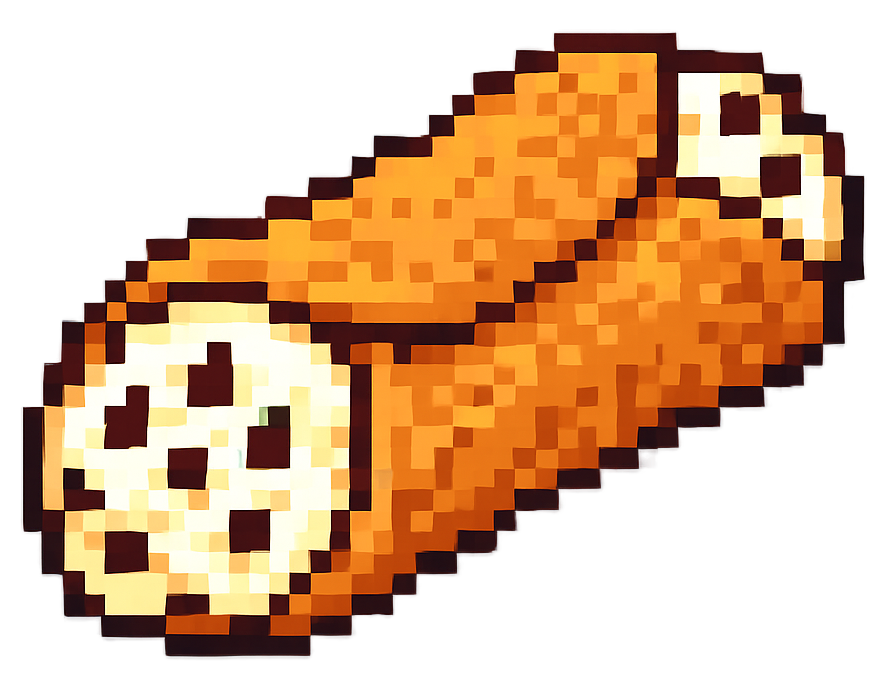

<h3 style="font-size: 35px; padding-top: 0px; padding-bottom: 0px; margin-bottom: 0px; margin-top: 5px;">
cannoli_OS    
</h3>

<h4 style="font-size: 18px; padding-top: 0px; margin-top: 0px;">A no-frills launcher for retro gaming.</h4>

---

# Why?

`¯\_(ツ)_/¯`

I built the [Game Manager](https://github.com/UncleJunVIP/nextui-game-manager) Pak
for [NextUI](https://nextui.loveretro.games) and thought isn't this essentially a launch launcher?

Taking what I've learned from building Paks, I wanted to try building a no-frills launcher for RetroArch.

--- 

# Design Goals

- Lightweight
- Minimal Configuration
- Easy to do basic things
- Easy to add new games
- Full access to RetroArch
- Judicious addition of features
- All binaries of known provenance

---

# Targeted Features

- [x] Simple Directory Structure

- [ ] In-Game Menu
    - [ ] Save State with Slots
    - [ ] Load State with Slots
    - [x] Reset Game
    - [x] RetroArch Menu
    - [x] Quit Game

- [ ] Manage Roms
    - [ ] Rename
    - [ ] Delete
    - [ ] Move
    - [ ] Search

- [ ] Collections
    - [ ] Create
    - [ ] Delete
    - [ ] Rename
    - [ ] Add / Remove / Reorder Games
    - [ ] Search

- [x] Custom Background Image

- [ ] Settings
    - [ ] Platform Core Mapping
    - [ ] Wi-Fi
    - [ ] Services Menu
    - [ ] Launch RetroArch Menu

--- 

# Features Never To Be Implemented

- Single SD Card supporting multiple devices
- Theming beyond a single background image
- Game Time Tracker
- LED Control
- Bluetooth
- USB Mass Storage
- Video Previews
